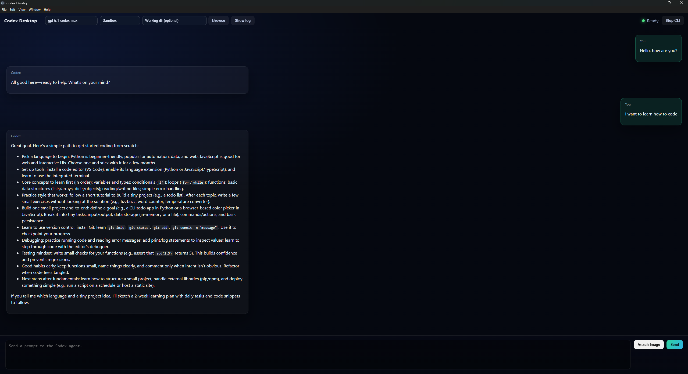

# Codex Desktop

Electron + React desktop client for Codex CLI. Lets you pick model/sandbox/working dir, attach images with previews, and view raw CLI logs.



## Features
- Sends prompts via `codex exec --json` (one process per message).
- Model dropdown, sandbox policy dropdown, working-dir picker (remembers recent dirs).
- Image attachments with data-URL previews and remove buttons.
- CLI log panel (stdout/stderr) to debug what Codex returns.
- Dev port cleaner (5173/5175) before start.

## Requirements
- Node.js 18+ (20+ recommended), npm.
- Codex CLI installed (`npm i -g @openai/codex` or official installer).
- Codex API key or `codex login`.
- Windows path example: `C:\Users\<you>\AppData\Roaming\npm\node_modules\@openai\codex\vendor\x86_64-pc-windows-msvc\codex\codex.exe`

## Quick start (dev)
```powershell
cd codex-desktop
npm install
$env:CODEX_CLI_PATH="C:\Users\<you>\AppData\Roaming\npm\node_modules\@openai\codex\vendor\x86_64-pc-windows-msvc\codex\codex.exe"
# optional if not logged in:
# $env:CODEX_API_KEY="sk-..."
npm run dev
```
- App opens via Electron, renderer on http://localhost:5175.
- Use header controls to pick model, sandbox, working dir (Browse).
- “Show log” toggles raw CLI output view.

## Build (desktop)
```bash
npm run dist
```
- Uses electron-builder; installers go to `dist/`.
- `index.html` includes a CSP meta for dev (allows localhost:5175, inline). For prod you can harden CSP (remove localhost/unsafe-inline) if you inline styles/scripts or add nonces.

## Environment variables
- `CODEX_CLI_PATH` (recommended on Windows): full path to `codex` binary.
- `CODEX_API_KEY` if you don’t use `codex login`.

## Known limitations
- Each message starts a fresh `codex exec`; conversation history is not preserved. For long context, either add a PTY-based chat (requires node-pty build) or prepend history to the prompt.
- CSP is dev-friendly; harden for production.
- No saved conversation history or profiles yet.

## GitHub push (manual)
```bash
git init
git add .
git commit -m "Initial Codex Desktop"
git branch -M main
git remote add origin https://github.com/<user>/codex-desktop.git
git push -u origin main
```

## Screenshot
- Place your image at `docs/screenshot.png` (README references it). The provided example from your run can be saved there.
